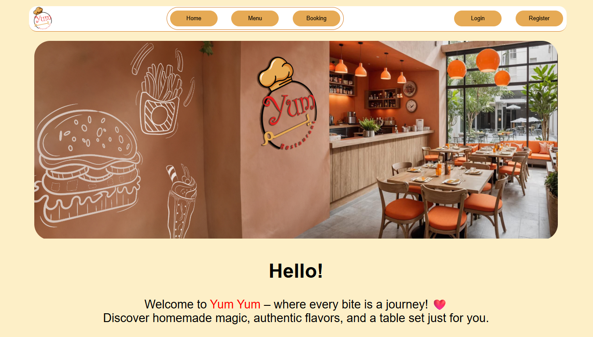
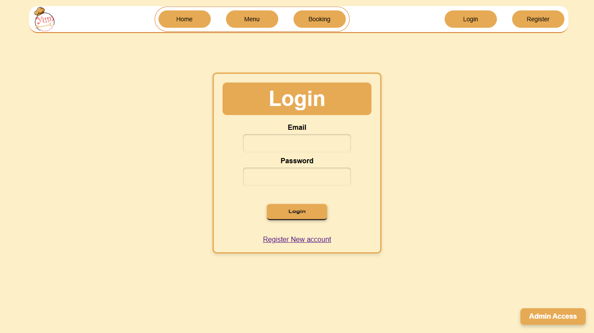
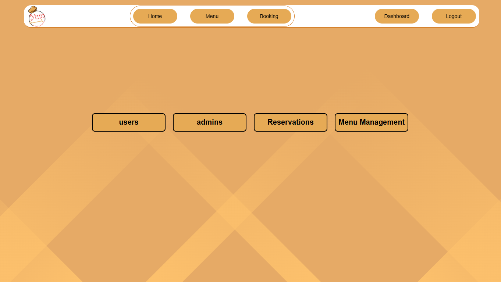

# Yum Yum Restaurant Project

  

A Laravel & MySQL restaurant reservation and menu management system.

---

## Tech Stack
- Laravel  
- MySQL  
- Blade  
- HTML / CSS / JavaScript  

---

## Authentication & Roles
- User registration & login  
- Admin login  
- Role-based access control  

---

## User Features
- Book a table  
- Select date and time  
- Choose number of guests  
- Select indoor or outdoor seating  

---

## Admin Features
- Access to admin dashboard  
- View all registered users (name & email)  
- View all reservations  
- Accept or reject reservations  
- Reservation status system:
  - Pending  
  - Approved  
  - Rejected  
- Add / edit / delete menu items  
- Admin has access to both user interface and dashboard  

---

## Screenshots

### Home Page

  

### User Registration / Login

  

### Admin Dashboard

  

